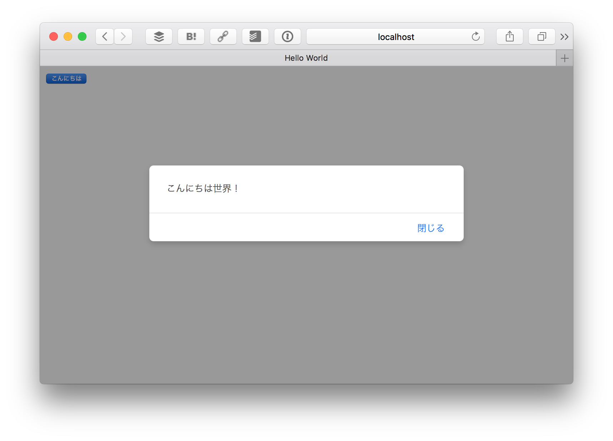

# hifiveをはじめてみよう

今回はまずhifiveに軽く触れてみたいと思います。プログラミング言語でよくあるHello Worldを出力します。

## hifiveの特徴

最初にhifiveの特徴を簡単に紹介します。

- jQueryと連携して使います
- MVCフレームワークです
- HTML4のブラウザでも動作互換性があります

jQueryが使えるので、これまで皆さんが習得してきたWebフロントエンド開発技術がそのまま使えます。

## ダウンロード

まずベースになる[HTML/JavaScriptファイル（Zipで固めてあります）をダウンロード](https://github.com/hifivemania/deviceconnect-handson/raw/master/1.zip)します。ダウンロードしたらZipファイルを解凍してください。

ファイル構成は次のようになっています。

```
$ tree .
.
├── index.html                      <- HTMLファイル
├── javascripts
│   ├── ejs-h5mod.js                <- EJS（テンプレートエンジン） 
│   ├── h5.dev.js                   <- 開発用hifive本体
│   ├── h5.js                       <- ミニファイ版hifive本体
│   ├── hello.js                    <- アプリ本体（今は空） 
│   ├── jquery-1.11.1.min.js        <- jQuery IE9以前用
│   └── jquery-2.1.1.min.js         <- jQuery IE10以降用
└── stylesheets
    └── h5.css                      <- hifiveのスタイルシート
```

index.htmlでは必要な各ファイルを読み込み済みです。これからhello.jsを作っていきます。

## hello.jsを作る

### コントローラの定義

hifiveはMVCフレームワークになります。今回はモデル（M）やビュー（V）はなく、HTML上のハンドリング（コントローラ = C）だけ使います。コントローラは次のように定義します（ `javascripts/hello.js` の内容はこうなっているはずです）。

```js
$(function() {
  // DOM構築完了
  
  // コントローラの定義
  var helloWorldController = {
    __name: 'HelloWorldController'
  };

  // コントローラ化する
  h5.core.controller('body', helloWorldController);
});
```

helloWorldControllerという変数名については任意です。そのhelloWorldControllerは **HelloWorldController** というコントローラ名を定義しています。そして、単なるハッシュである helloWorldController をコントローラ化するメソッドが `h5.core.controller` になります。

その際、'body' という指定を行っています。これは、どのHTMLタグに対してバインドするか（コントローラの管理下に置くか）という指定になります。今回の場合はbodyタグ以下になります。ここはjQueryのように **#container** や **.sidebar** のようにCSSセレクタが利用できます。

これでbodyタグ内に対して HelloWorldController が有効になりました。

### 処理を書く

今回はボタンを押すとアラートを出すという処理を作ってみます。HTML上のハンドリングはコントローラで行いますので、次のようにHelloWorldControllerを修正します。

**修正前：**

```
// コントローラの定義
var helloWorldController = {
  __name: 'HelloWorldController'
};
```

**修正後**

```
// コントローラの定義
var helloWorldController = {
  __name: 'HelloWorldController', // <- カンマを忘れずに
  '#button click': function() {
    alert("こんにちは世界！");
  }
};
```

これで修正は完了です。hello.js全体は次のようになります。

```
$(function() {
  // DOM構築完了
  
  // コントローラの定義
  var helloWorldController = {
    __name: 'HelloWorldController', // <- カンマを忘れずに
    '#button click': function() {
      alert("こんにちは世界！");
    }
  };
  
  // コントローラ化する
  h5.core.controller('body', helloWorldController);  
});
```

ではHTMLをWebブラウザで開いてボタンを押してみましょう。

このように**こんにちは世界！**というアラートが出てくれば完了です。



### 素のjQueryで書いた場合

今回はとても簡単なコードなので、hifiveを使わない場合は次のように書けます。

```
$(function() {
  $('#button').on('click', function() {
    alert("こんにちは世界！");
  });
});
```

このコードだけ見れば素のjQueryだけを使った方が簡単に見えますが、処理が長くなったり、処理を使い回したりするとどんどんコードが複雑になっていきます。MVCをきちんと切り分けて処理をまとめていくことで見通しの良い、メンテナンス性に優れたWebアプリケーションが開発できるようになります。

hello.jsを含む今回のコードは [deviceconnect-handson/1 at master · hifivemania/deviceconnect-handson](https://github.com/hifivemania/deviceconnect-handson/tree/master/1) にて確認できます。また、[実際に動いているデモはこちらのURL](https://hifivemania.github.io/deviceconnect-handson/1/)にて確認できます。

## 今回はhifiveの基本を紹介しました。[次にDeviceConnectの基礎を学びます](./2.md)に入っていきます。
