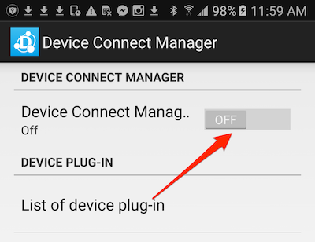
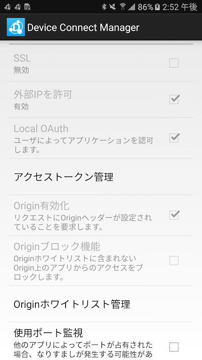
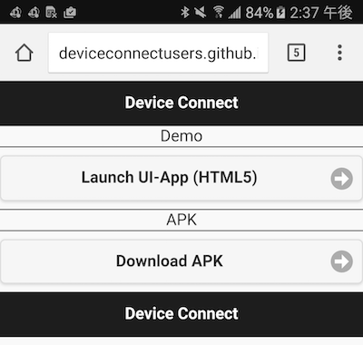
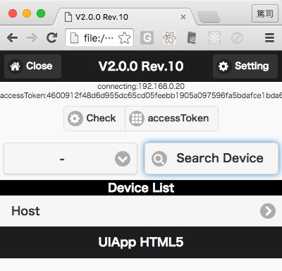
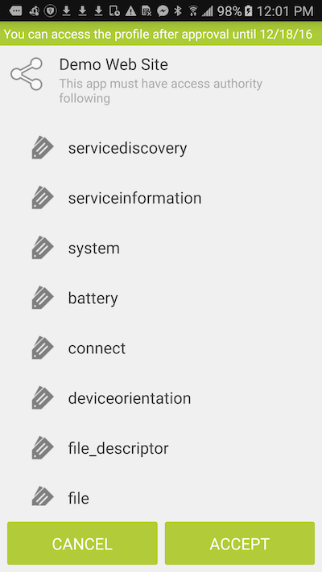
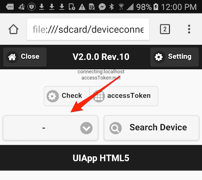
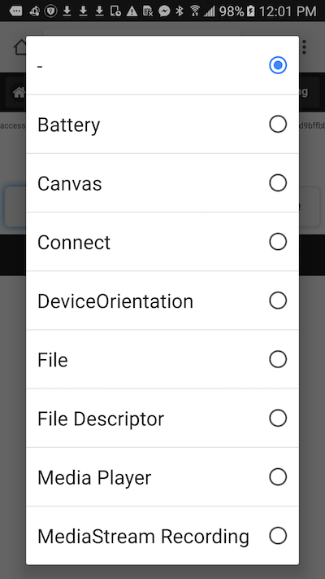
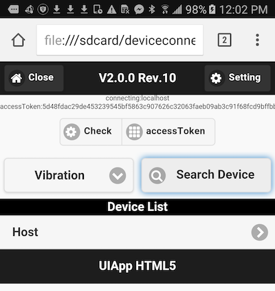
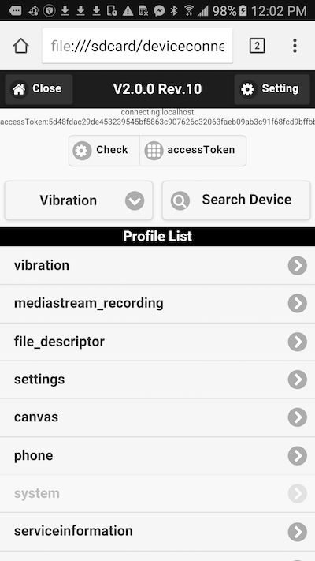
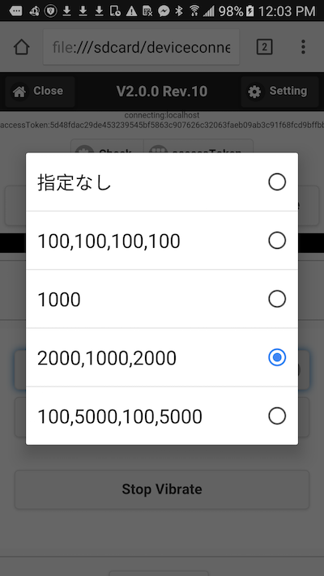

# DeviceConnectの基礎を学ぼう

DeviceConnectとは、スマートフォンと外部デバイス（THETAであったり、Pebble、心拍計など）とを繋ぐ技術です。通常、これらのデバイスと繋ぐためにはWiFi、Bluetooth、BLE、NFCなどの知識が必要です。DeviceConnectでは接続に関する手間を代わりに行ってくれます。そして各種プロトコルに代わってWeb APIを提供します。

つまり、Web APIを使って各種デバイスからデータを受け取ったり、逆に書き込んだりできます。ただし、ここで注意点があります。

- Androidはローカルサーバを「バックグラウンドで **立てられます**」
- iOSはローカルサーバを「バックグラウンドで **立てられません**」

そのため、AndroidはDeviceConnectのサーバ機能だけ、iOSではブラウザを内包する形で（フォアグラウンドに出ている必要があるため）提供されます。

## DeviceConnectManagerのインストール

Android、iOSそれぞれアプリをインストールします。

- [Android](https://play.google.com/store/apps/details?id=org.deviceconnect.android.manager&hl=ja)
- [iOS](https://itunes.apple.com/jp/app/devicewebapibrowser/id994422987?mt=8&ign-mpt=uo%3D4)

それぞれ使い方が異なるので注意してください。

### Androidの場合

Device Connect Managerを立ち上げます。

仮想サーバを立ち上げると、 http://localhost:5432/ でDeviceConnectが立ち上がっています。

外部（デスクトップ）ブラウザからアクセスできるようにするため、下記の設定を行ってください。

- **外部IPを許可**  
有効にする
- **Originブロック機能**  
無効にする

### iOSの場合

DeviceWebAPIBrowserを立ち上げるとすでにDeviceConnect（サーバ）が立ち上がっています。

## 試す

以下のURLにアクセスしてみましょう。

http://deviceconnectusers.github.io/manager/

Launch UI-App (HTML5) をクリックします。

画面が表示されたら、access Tokenボタンをクリックします。

OAuth認証が出るので、ACCEPTします。

元の画面に戻ると、アクセストークンが表示されているはずです。

## 使ってみる

では実際に機能を試してみます。左下にあるドロップダウンをタップします。

そうすると使える機能が一覧で表示されます。

今回は例えばVibration（バイブレーション）を選択します。さらにSearch Deviceをタップすると、DeviceConnectが使えるデバイス（今回は実機）がリストアップされます。これはプラグインによって他のウェアラブルデバイスなどを対応させられます。

Hostというのをタップすると、Profile Listが表示されますので、この中からVibrationを選択します。

この画面でVibrateをタップすると、実際に実機がバイブレーションします。ローカルのHTMLファイルからDeviceConnect WebAPIを通じて実機を操作できるのが分かるでしょう。

さらにバイブレーションのタイミングを変更することもできます。

スマートフォンが震えれば成功です。

----

今回はDeviceConnectを軽く体験しました。[次回はhifiveの一機能、ロジック処理について学びます](./3.md)。
