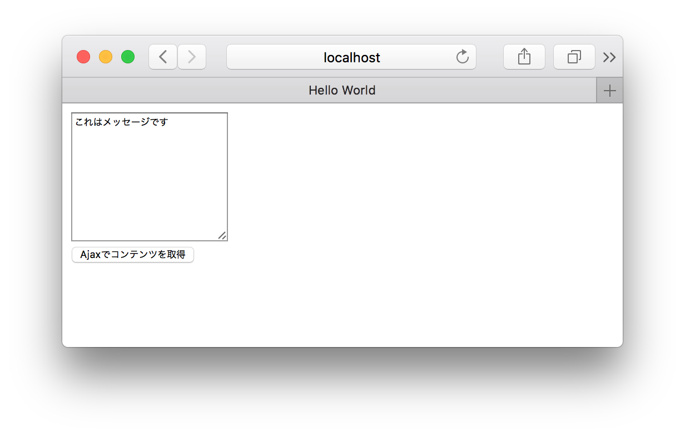

# hifiveのロジック処理について

今回はhifiveの一機能であるロジック処理について学びます。hifiveはMVCフレームワークですが、さらにL（ロジック）機能があります。これは計算処理であったり、非同期処理を担当することでコントローラ内の実装を減らし、再利用性を高めています。

DeviceConnectとのやり取りは **非同期処理で行われます** ので、今回はまずロジックの基本を学習します。

## ダウンロード

まずベースになる[HTML/JavaScriptファイル（Zipで固めてあります）をダウンロード](https://github.com/hifivemania/deviceconnect-handson/blob/master/3.zip?raw=true)します。ダウンロードしたらZipファイルを解凍してください。

ファイル構成は次のようになっています。

```
$ tree .
.
├── content.txt                <- Ajaxで取得する内容
├── index.html                 <- HTMLファイル
├── javascripts
│   ├── ejs-h5mod.js           <- EJS（テンプレートエンジン） 
│   ├── h5.dev.js              <- 開発用hifive本体
│   ├── h5.js                  <- ミニファイ版hifive本体
│   ├── logic.js               <- アプリ本体（今は空） 
│   ├── jquery-1.11.1.min.js   <- jQuery IE9以前用
│   └── jquery-2.1.1.min.js    <- jQuery IE10以降用
└── stylesheets
    └── h5.css                 <- hifiveのスタイルシート
```

index.htmlでは必要な各ファイルを読み込み済みです。これからlogic.jsを作っていきます。

## logic.jsを作る

最初、logic.jsの内容は次のようになっています。ロジック `ajaxLogic` とコントローラ `logicController` を定義しています。

```js
$(function() {
  // DOM構築完了
  
  // ロジックを定義する
  var ajaxLogic = {
    __name: 'ajaxLogic',
    
    // 3. データを取得して返却
    getLocalData: function(path) {
    } 
  };
  
  // コントローラの定義
  var logicController = {
    __name: 'logicController',
    ajaxLogic: ajaxLogic,
    
    // 1. ボタンを押した時の処理
    '#button click': function() {
    },
    
    // 2. データを取得して表示するまでの処理
    getData: function(response) {
    }
  };

  // コントローラ化する
  h5.core.controller('body', logicController);
});
```

ロジックをコントローラ内で使う際には、 `〜Logic` というキーでロジックを指定します。今回の例で言えば `ajaxLogic: ajaxLogic` が該当します。

### 1. getDataを作る

コントローラでボタンを押した時のイベント `#button click` は `this.getData` を呼び出します。これはイベントハンドリングに徹する他、非同期処理を行う上で面倒になりがちなネスト処理を回避するためのhifiveらしい記述を行います。

```js
// 1. ボタンを押した時の処理
'#button click': function() {
  this.getData(
    // ロジックを呼び出します
    this.ajaxLogic.getLocalData('/content.txt')
  );
},
```

次にコントローラのgetDataを実装します。ここで注目したいのは `h5.async.isPromise` です。非同期処理で使われるPromiseオブジェクトかどうかを判定しています。もしPromiseオブジェクト（非同期処理中）であれば、処理完了 `response.done` を待って、結果 `response` を再度 `getData` に送ります。これによってネストが浅くなります。

```js
// 2. データを取得して表示するまでの処理
getData: function(response) {
  if (h5.async.isPromise(response)) {
    // Promiseオブジェクトの場合
    // 処理完了を自分を再帰呼び出し
    response.done(this.own(function(response) {
      this.getData(response);
    }));
  } else {
    // 結果を書き込み
    this.$find('#result').val(response);
  }
}
```

上のコードで `this.own` という記述がありますが、これは以下と同じ意味です（下のコードは記述しないでください）。JavaScriptのthisは関数内やスコープによって変化してしまうので、this.ownを使うことでthisがコントローラ自身を示すようになります。

```js
////////////////////////////
// このコードは記述しません
////////////////////////////
var me = this;
response.done(function(response) {
  me.getData(response);
});
```

### ロジックを作る

ではロジックを作ります。これは与えられたパスのファイルを取得して、返却する関数です。hifiveのPromiseでは `this.deferred()` を使います。そして、最後に `dfd.promise()` としてPromiseオブジェクトを返却します。

Ajax処理は `h5.ajax` で行います。これはjQueryの `$.ajax` のラッパーです。そして処理が成功した時には `dfd.resolve` 、失敗時には `dfd.reject` を呼び出します。

```js
// ロジックを定義する
var ajaxLogic = {
  __name: 'ajaxLogic',
  
  // 3. データを取得して返却
  getLocalData: function(path) {
    var dfd = this.deferred();
    // Ajax処理
    h5.ajax(path, {
      type: 'GET'
    })
    .then(function(response) {
      // 取得成功
      dfd.resolve(response);
    })
    .fail(function(err) {
      // 取得失敗
      dfd.reject(err);
    });
    // Promiseオブジェクトを返却します
    return dfd.promise();
  } 
};
```

## 全体の処理について

logic.js は以下のようになります。

```js
$(function() {
  // DOM構築完了
  
  // ロジックを定義する
  var ajaxLogic = {
    __name: 'ajaxLogic',
    
    // 3. データを取得して返却
    getLocalData: function(path) {
      var dfd = this.deferred();
      h5.ajax(path, {
        type: 'GET'
      })
      .then(function(response) {
        // 取得成功
        dfd.resolve(response);
      })
      .fail(function(err) {
        // 取得失敗
        dfd.reject(err);
      });
      // Promiseオブジェクトを返却します
      return dfd.promise();
    } 
  };
  
  // コントローラの定義
  var logicController = {
    __name: 'logicController',
    ajaxLogic: ajaxLogic,
    
    // 1. ボタンを押した時の処理
    '#button click': function() {
      this.getData(
        // ロジックを呼び出します
        this.ajaxLogic.getLocalData('/content.txt')
      );
    },
    
    // 2. データを取得して表示するまでの処理
    getData: function(response) {
      if (h5.async.isPromise(response)) {
        // Promiseオブジェクトの場合
        // 処理完了を自分を再帰呼び出し
        response.done(this.own(function(response) {
            this.getData(response);
        }));
      } else {
        // 結果を書き込み
        this.$find('#result').val(response);
      }
    }
  };

  // コントローラ化する
  h5.core.controller('body', logicController);
});
```

----

ここまででhifiveのロジックの基本が完了です。実際にWebブラウザで開いてみると、ボタンを押すとファイルの内容がテキストエリアに書き込まれるのが分かるはずです。



このようにコントローラとロジックを分割することで、処理の見通しがよくなったり、メンテナンス性が向上します。

logic.jsを含む今回のコードは [deviceconnect-handson/3 at master · hifivemania/deviceconnect-handson](https://github.com/hifivemania/deviceconnect-handson/tree/master/3) にて確認できます。また、[実際に動いているデモはこちらのURL](https://hifivemania.github.io/deviceconnect-handson/3/)にて確認できます。

では[次からDeviceConnectのセットアップに入ります](./4.md)。
