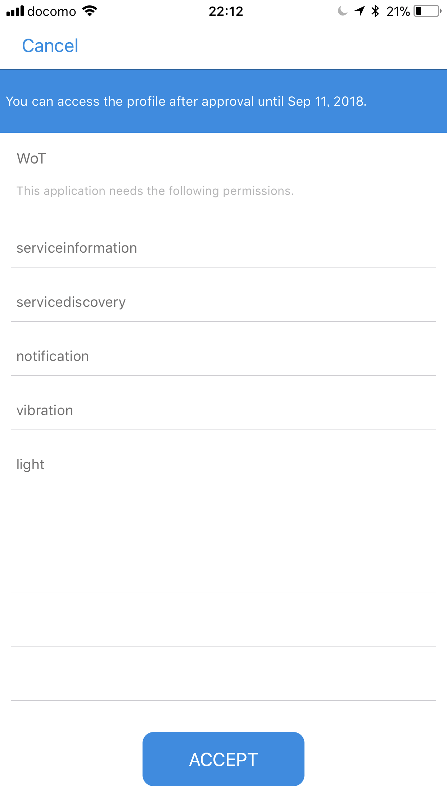

# DeviceConnectをセットアップする

今回はDeviceConnectをセットアップする処理を作ります。まず DeviceConnect を使える状態にするまでに以下のステップが必要です。

- DeviceConnectの生死確認
- DeviceConnectを扱う認可を得る
- DeviceConnectで使えるデバイス一覧を得る

# 今回はすべて app.js に記述済みです。内容の確認だけ行ってください。バイブレーション機能から記述していきます。

## ダウンロード

まずベースになる[HTML/JavaScriptファイル（Zipで固めてあります）をダウンロード](https://github.com/hifivemania/deviceconnect-handson/blob/master/4.zip?raw=true)します。ダウンロードしたらZipファイルを解凍してください。

ファイル構成は次のようになっています。

```
├── index.html
├── javascripts
│   └── app.js                     <- コードを記述するJavaScriptファイル
└── vendors                        <- 外部ライブラリ
    ├── bootstrap                  <- Bootstrap。画面用
    ├── deviceconnect
    │   ├── dconnectsdk-2.2.0.js   <- DeviceConnectのJavaScript SDK
    │   └── util.js
    ├── hifive
    │   ├── 1.3.1
    │   ├── ejs-h5mod.js
    │   ├── h5.css
    │   ├── h5.dev.js              <- 開発用のhifiveライブラリ
    │   ├── h5.js
    │   └── h5.js.map
    ├── jquery                     <- jQuery
    └── js-url                     <- ブラウザのURLから情報を取得するライブラリ
```

DeviceConnectのJavaScript SDKは[DeviceConnect/DeviceConnect-JS: Javascript code of demonstration, and SDK](https://github.com/DeviceConnect/DeviceConnect-JS)から入手できます（今回はすでに内包済みです）。

index.htmlでは必要な各ファイルを読み込み済みです。

## 実装の確認

バイブレーション機能の実装まではコードを書きません。 `app.js` の内容を確認してください。

### DeviceConnectの生死確認

DeviceConnectではJavaScript SDKを提供しています。これを使うことで実装が簡単になります。コードは以下のようになります。

```js
////////////////////////
// このコードは記述しません
////////////////////////
dConnect.setHost('localhost');
dConnect.setPort(5432);
dConnect.checkDeviceConnect(
  function(apiVersion) {
    // 生死確認OK
  },
  function (errorCode, errorMessage) {
    // 生死確認失敗（またはサーバが立ち上がっていない）
  }
);
```

### DeviceConnectを扱う認可を得る

認可を得るというのはOAuth2に則ってDeviceConnectの操作許可を得る処理になります。使いたい機能（バイブレーションなど）を配列で指定します。認可が得られればアクセストークンが返ってきます。各処理を行う際に、このアクセストークンを使って認証の代わりとします。

```js
////////////////////////
// このコードは記述しません
////////////////////////
dConnect.authorization(
  [/* 使いたい機能の配列 */],
  'APPLICATION_NAME',
  function (clientId, accessToken) {
    // 許可獲得
  },
  function (errorCode, errorMessage) {
    // 許可獲得不可
  }
);
```

### DeviceConnectで使えるデバイス一覧を得る

許可が得られたら、DeviceConnectで使えるデバイスを取得します。アクセストークンを指定する必要があります。

```js
////////////////////////
// このコードは記述しません
////////////////////////
dConnect.discoverDevices(
  'ACCESS_TOKEN',
  function (json) {
    // デバイス一覧
  },
  function (errorCode, errorMessage) {
    // エラー
  }
);
```

## app.jsを確認する

最初の `app.js` の構成は次のようになっています。DeviceConnectとの処理は `dcLogic` の中に記述します。DOMイベントのハンドリングを行う コントローラ `appController` は準備が完了すると `_ready` を呼び出します（hifiveの仕様です）。このタイミングでコントローラの `setup` メソッドを呼び出します。

```js
$(() => {
  // ロジック
  var dcLogic = {
    __name: 'DCLogic',
    __services: [],
    __accessToken: null,
    __clientId: null,
    
    // セットアップ処理全体
    setup: function(options) {
      // 省略
    },
    
    // DeviceConnectの生死チェック
    check: function(options) {
      // 省略
    },
    
    // 認可を得る処理
    grant: function(options) {
      // 省略
    },
    
    // サービスをリストアップする処理
    discover: function(options) {
      // 省略
    },
    // 省略
  };
  
  var appController = {
    __name: 'AppController',
    dcLogic: dcLogic,
    // デフォルトの設定
    
    // コントローラ化が完了したら実行
    __ready: function() {
      // セットアップ処理を呼び出す
    },
    
    // セットアップ処理
    setup: function(response) {
    },
    
    // 省略
  };
  
  h5.core.controller('.container', appController);
});
```

### DeviceConnect接続用の情報を設定

DeviceConnectに接続する際の情報をコントローラ内に定義します。これは区別しやすいよう、 `__` を変数名の頭につけるのが hifive 流です。 `url(?host)` というのは 外部ライブラリの js-url です（組み込み済みです）。URLのクエリやアンカーなどを扱いやすくしています。ここではクエリストリングのhostがあればその値を、なければ localhost:4035 を利用するとしています。

クエリストリングのhostというのは `http://example.com/?host=192.168.0.23:3000` のように指定します。

アプリケーション名（__applicationName） は適当です。利用したい機能（バイブレーション、ライト、通知）をそれぞれスコープ `__scopes` で指定しつつ、最低限必要な `serviceinformation` と `servicediscovery` も追加しておきます。

```js
/////////////////////////////
// 記述済みです
/////////////////////////////
var appController = {
  __name: 'AppController',
  dcLogic: dcLogic,
  // デフォルトの設定
  __applicationName: "WoT",
  __host: url('?host') || 'localhost:4035',
  __scopes: [
    "serviceinformation",
    "servicediscovery",
    "notification",
    "vibration",
    "light"
  ],
}
```

### セットアップを開始する

ではコントローラができあがったタイミングで呼ばれる `__ready` を記述します。ここではコントローラのセットアップメソッドを呼び出します。その際、先ほど指定したDeviceConnect接続用の情報を渡します。

```js
/////////////////////////////
// 記述済みです
/////////////////////////////
// コントローラ化が完了したら実行
__ready: function() {
  this.setup(this.dcLogic.setup({
    applicationName: this.__applicationName,
    host: this.__host,
    scopes: this.__scopes
  }));
},
```

コントローラのセットアップ処理では受け取った情報を使ってロジックのセットアップ処理を行います。この処理は非同期になるので、前回行ったPromise判定処理を使います。

レスポンスにはアクセストークン（accessToken）、クライアントID（clientId）、利用できるデバイス情報（services）が入ってくることとします。この返却値はこれから作ります。

```js
/////////////////////////////
// 記述済みです
/////////////////////////////
// セットアップ処理
setup: function(response) {
  if (h5.async.isPromise(response)) {
    response.done(this.own(function(response) {
      this.setup(response);  
    }));
  } else {
    this.dcLogic.__accessToken = response.accessToken;
    this.dcLogic.__clientId = response.clientId;
    this.dcLogic.__services = response.services;
  }
},
```

## ロジックの実装

ではロジックの実装に入ります。まず setup メソッドで全体の流れを確認します。つまり以下の3つの処理を行います。

1. DeviceConnectの生死確認（check）
1. DeviceConnectを扱う認可を得る（grant）
1. DeviceConnectで使えるデバイス一覧を得る（discover）

現在は以下のようになっているはずです。

```js
/////////////////////////////
// 記述済みです
/////////////////////////////
// セットアップ処理全体
setup: function(options) {
  var dfd = this.deferred();
  var results = {};
  this.check(options)
  .then(this.own(function() {
    // 認可を得る
    return this.grant(options);
  }))
  .then(this.own(function(response) {
    results = {
      accessToken: response.accessToken,
      clientId: response.clientId
    };
    // 使えるサービスの一覧を得る
    return this.discover(results);
  }))
  .then(function(services) {
    results.services = services;
    return dfd.resolve(results);
  })
  // エラーの時はここ
  .fail(function(err) {
    dfd.reject(err);
  })
  return dfd.promise();
},
```

ではそれぞれの処理を作っていきましょう。

### DeviceConnectの生死確認（check）

元々はこうなっています。

```js
/////////////////////////////
// 記述済みです
/////////////////////////////
// DeviceConnectの生死チェック
check: function(options) {
  // 省略
},
```

ここに、先ほど紹介したDeviceConnectの生死チェックのコードを書きます（ `dConnect.checkDeviceConnect` を使います）。`options.host` は `localhost:4053` のようになっていますので、 `:` で区切って前の文字列をホスト、後の文字をポート番号として使います。そして生死をチェックした後、その結果をPromiseのresolve/rejectとして処理します。

```js
/////////////////////////////
// 記述済みです
/////////////////////////////
// DeviceConnectの生死チェック
check: function(options) {
  var dfd = this.deferred();
  dConnect.setHost(options.host.split(":")[0]);
  dConnect.setPort(options.host.split(":")[1]);
  dConnect.checkDeviceConnect(
    // 接続確認完了
    function(apiVersion) {
      dfd.resolve({apiVersion: apiVersion});
    },
    // 接続失敗
    function (errorCode, errorMessage) {
      // エラーを送信します
      dfd.reject({
        errorCode: errorCode,
        errorMessage: errorMessage
      });
    }
  );
  return dfd.promise();
},
```

### DeviceConnectを扱う認可を得る（grant）

認可を得るには `dConnect.authorization` を実行します。この時、使いたい機能（スコープ）とアプリケーション名（任意の文字列）を指定します。その結果としてクライアントIDとアクセストークンが返ってきますので、Promise.resolveとして送信します。

```js
/////////////////////////////
// 記述済みです
/////////////////////////////
// 認可を得る処理
grant: function(options) {
  var dfd = this.deferred();
  dConnect.authorization(
    options.scopes,
    options.applicationName,
    // 認可取得成功
    function (clientId, accessToken) {
      dfd.resolve({
        clientId: clientId,
        accessToken: accessToken
      });
    },
    // 認可取得失敗
    function (errorCode, errorMessage) {
      dfd.reject({
        errorCode: errorCode,
        errorMessage: errorMessage
      });
    }
  );
  return dfd.promise();
},
```

### DeviceConnectで使えるデバイス一覧を得る（discover）

アクセストークンが取得できたらデバイス一覧を得ます（`dConnect.discoverDevices` を実行します）。この時、先の処理で受け取ったアクセストークンを指定する必要があります。

```js
/////////////////////////////
// 記述済みです
/////////////////////////////
// デバイスをリストアップする処理
discover: function(options) {
  var dfd = this.deferred();
  dConnect.discoverDevices(
    options.accessToken,
    // 一覧取得成功
    function (json) {
      dfd.resolve(json.services);
    },
    // 一覧取得失敗
    function (errorCode, errorMessage) {
      dfd.reject({
        errorCode: errorCode,
        errorMessage: errorMessage
      });
    }
  );
  return dfd.promise();
},
```

----

ここまで確認したら、スマートフォンのブラウザからこのデスクトップのHTTPサーバにアクセスしてみましょう。認可のダイアログが出れば成功です。



今回のコードは [deviceconnect-handson/4 at master · hifivemania/deviceconnect-handson](https://github.com/hifivemania/deviceconnect-handson/tree/master/4) にて確認できます。また、[実際に動いているデモはこちらのURL](https://hifivemania.github.io/deviceconnect-handson/4/)にて確認できます。

では[次はバイブレーション機能を作ってみましょう](./5.md)。
